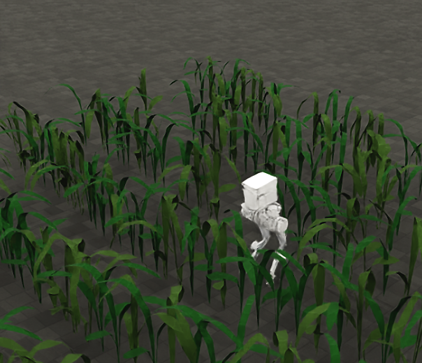

<h1 align="center"> Hunter Robot Training in IsaacSim </h1>

<div align="center">

[](https://docs.isaacsim.omniverse.nvidia.com/4.2.0/index.html)

[](https://isaac-sim.github.io/IsaacLab/)

[](https://ubuntu.com/blog/tag/22-04-lts)
[]()

</div>

# Hunter Robot Locomotion Training

This repository provides a complete training pipeline for the Hunter humanoid robot using IsaacSim/IsaacLab. The framework implements a progressive 3-stage curriculum learning approach that enables robust locomotion policies across diverse terrains, from simple planes to challenging soil conditions.</div>

## Pretrained Models

Trained Hunter locomotion checkpoints are released on the Hugging Face Hub:

<div align="center">
  <a href="https://huggingface.co/anhrisn/hunter-dfh-locomotion">
    
  </a>
  <br/>
  <em>Hunter walking through a maize row-crop field in IsaacSim (DFH deformable, furrowed soil).</em>
</div>

**Model repo:** [`anhrisn/hunter-dfh-locomotion`](https://huggingface.co/anhrisn/hunter-dfh-locomotion) (public, MIT)

The release covers locomotion on **deformable, furrowed agricultural terrain** modelled with the DFH (Deformable Furrowed Heightfield: Bekker terramechanics + anisotropic friction + sink-coupled lateral drag):

| Group | What | Deploy? |
|---|---|---|
| `walkers/mildsoil_walker/model_5050.pt` | True forward walker on mild DFH soil (~0.12 BW drag) | **Recommended deployment target** |
| `walkers/v7_baseline/model_4250.pt` | Flat-ground walker; warm-start root; used in the agri-field render above | Baseline |
| `walkers/rigid_walker/model_5050.pt` | Walker on rigid furrows (no soil drag) | Reference |
| `dfh_chain/` (12 stages) | Drag-survival curriculum (robust balancers, not walkers) | Research / warm-start only |

Each checkpoint folder on the Hub ships its training-time `config.yaml`, so it loads directly:

```bash
python humanoidverse/eval_agent.py +checkpoint=<downloaded>/walkers/mildsoil_walker/model_5050.pt
```

## Features
- **3-Stage Curriculum Learning**: Progressive training from plane terrain → soft soil → full randomization
- **Hunter Robot Support**: Optimized for Hunter humanoid robot with complete locomotion pipeline
- **IsaacSim/IsaacLab Integration**: Built on NVIDIA's Isaac simulation platform
- **Robust Evaluation**: Multiple terrain scenarios including soil conditions and external perturbations
- **Complete Training Pipeline**: From basic locomotion to advanced terrain navigation


# Environment Setup

## Prerequisites
- NVIDIA GPU with CUDA support
- Linux Ubuntu 22.04 or later
- Miniconda or Anaconda
- IsaacSim 4.2.0
- IsaacLab 1.4.1

## Quick Setup
```bash
# 1. Activate IsaacLab conda environment
source ~/miniconda3/bin/activate isaaclab

# 2. Install HumanoidVerse dependencies
pip install -e .

# 3. Verify IsaacSim integration
python -c "import isaacsim; print('IsaacSim imported successfully')"
```

For detailed installation instructions, please refer to the [Installation Guide](docs/installation_guide.md).


# Curriculum Training Pipeline

The Hunter robot training follows a 3-stage curriculum learning approach for robust locomotion across diverse terrains.

## Stage 0: Foundation Training (Plane Terrain)
Build basic locomotion skills on flat terrain:

```bash
# Test training (small scale)
python humanoidverse/train_agent.py \
+curriculum=stage0_plane \
+robot=hunter/hunter \
+simulator=isaacsim \
+exp=locomotion \
+obs=loco/leggedloco_obs_singlestep_withlinvel \
num_envs=16 \
project_name=CurriculumStage0Test \
experiment_name=Hunter_Stage0_Plane \
headless=False

# Full training
python humanoidverse/train_agent.py \
+curriculum=stage0_plane \
+robot=hunter/hunter \
+simulator=isaacsim \
+exp=locomotion \
+obs=loco/leggedloco_obs_singlestep_withlinvel \
num_envs=4096 \
project_name=CurriculumStage0 \
experiment_name=Hunter_Stage0_Plane \
headless=True
```

## Stage 1: Soil Adaptation Training
Continue from Stage 0 model with soft soil terrain:

```bash
# Continue from Stage 0 (recommended)
python humanoidverse/train_agent.py \
+curriculum=stage1_soft_soil \
+robot=hunter/hunter \
+simulator=isaacsim \
+exp=locomotion_soil \
+obs=loco/leggedloco_obs_singlestep_withlinvel \
++simulator.config.scene.env_spacing=4.0 \
+checkpoint=logs/CurriculumStage0/latest/model.pt \
num_envs=2048 \
project_name=CurriculumStage1Continue \
experiment_name=Hunter_Stage1_FromStage0 \
headless=True
```

## Stage 2: Full Randomization Training
Final stage with complete domain randomization:

```bash
# Continue from Stage 1 (recommended)
python humanoidverse/train_agent.py \
+curriculum=stage2_full_rand \
+robot=hunter/hunter \
+simulator=isaacsim \
+exp=locomotion_soil_advanced \
+obs=loco/leggedloco_obs_singlestep_withlinvel \
++simulator.config.scene.env_spacing=4.0 \
+checkpoint=logs/CurriculumStage1/latest/model.pt \
num_envs=2048 \
project_name=CurriculumStage2Continue \
experiment_name=Hunter_Stage2_FromStage1 \
headless=True
```

# Furrowed & Deformable Soil (DFH) Training

This is the core contribution: walking on **furrowed, deformable agricultural
soil**. Two terrain families are used — geometric **furrows** (height field rows)
and the **DFH** soil model (Deformable Furrowed Heightfield: Bekker
terramechanics + anisotropic friction + sink-coupled lateral drag, where
`drag = k · sinkage · normal_force`, clamped at `max_drag_force_n`).

## Furrows curriculum (geometry only)

Staged furrow terrain, warm-started stage to stage:

```bash
# Stage 1: easy furrows (shallow, aligned)
python humanoidverse/train_agent.py \
+robot=hunter/hunter +simulator=isaacsim \
+exp=locomotion_soil +algo=ppo_soil \
+obs=loco/leggedloco_obs_singlestep_withlinvel \
+rewards=loco/reward_hunter_soil_locomotion \
+terrain=terrain_furrows_stage1_easy \
num_envs=2048 headless=True \
project_name=SoilFurrows experiment_name=Hunter_Furrows_S1_Easy

# Stage 2 (medium) / Stage 3 (full): swap terrain + warm-start from previous stage
#   +terrain=terrain_furrows_stage2_medium   (then terrain_furrows_stage3_full)
#   +checkpoint=logs/SoilFurrows/<run>/model_<iter>.pt
```

## DFH soil — walker (recommended)

Re-derives a forward **walker** on DFH soil using the flat-ground walking
objective. This is the recipe behind `walkers/mildsoil_walker` on Hugging Face.
A convenience wrapper exists at `extensions/dfh/scripts/walk_paired_control_arm.sh`
(takes `TERRAIN`, `RUN_NAME`, `WARM_CKPT`, `DFH_OVERRIDES`, `ITERS`), or run it directly:

```bash
python humanoidverse/train_agent.py \
+simulator=isaacsim +exp=locomotion algo=ppo_roa \
+robot=hunter/hunter \
+obs=loco/leggedloco_obs_history_wolinvel \
+terrain=terrain_dfh_stage1_easy \
+rewards=loco/reward_hunter_locomotion \
++rewards.reward_scales.tracking_lin_vel=4.0 \
+domain_rand=NO_domain_rand \
checkpoint=logs/FixedStageFv7/<run>/model_4250_std055.pt auto_load_latest=False \
num_envs=2048 headless=True \
++env.config.locomotion_command_ranges.lin_vel_x=[0.25,0.45] \
++env.config.locomotion_command_ranges.lin_vel_y=[0.0,0.0] \
++env.config.locomotion_command_ranges.ang_vel_yaw=[0.0,0.0] \
++terrain.dfh.force_coupling.sinkage_drag_k=8.0 \
++terrain.dfh.force_coupling.max_drag_force_n=200.0 \
++terrain.dfh.params.sinkage_floor_m=-0.05 \
project_name=DFH_Hunter_ROA experiment_name=Hunter_DFH_Walker_S1
```

The DFH soil is activated by the `terrain_dfh_*` config (`dfh_enabled: True`), not
by `+exp`. Advance the soil dose **one axis at a time** (sinkage depth *or* drag),
scaling `max_drag_force_n` with `sinkage_drag_k` to keep the saturation ratio
(~0.047) flat.

## DFH soil — drag-survival curriculum (research)

The staged dose-ladder that hardens the policy against heavy drag (produces
robust *balancers*, archived as `dfh_chain/` on Hugging Face):

```bash
# Stage 1 (warm-started from the v7 walker); see scripts for S1.5→S3 chain
bash extensions/dfh/scripts/train_dfh_s1_from_v7.sh          # full run
SMOKE=1 bash extensions/dfh/scripts/train_dfh_s1_from_v7.sh  # 50-iter smoke test
```

# Testing on Furrow / DFH Soil

## Qualitative rollout (visual, with maize field)

```bash
python humanoidverse/eval_agent.py \
+simulator=isaacsim \
+checkpoint=logs/FixedStageFv7/<run>/model_4250.pt \
+terrain=terrain_furrows_with_maize \
+eval_command=[0.3,0.0,0.0] \
num_envs=1 headless=False
```

## Quantitative metrics (velocity tracking, episode length, falls)

```bash
# DFH soil (or swap +terrain=terrain_furrows_stage1_easy for furrows)
python humanoidverse/sample_eps.py \
+simulator=isaacsim \
+checkpoint=<your_model>.pt \
+terrain=terrain_dfh_stage1_easy \
+eval_command=[0.3,0.0,0.0] \
num_envs=64 +num_episodes=64 headless=True
```

> Evaluation is **train-matched** by default (`eval_match_train=True`): the harness
> restores the training-time control gains, termination, and episode cap so a policy
> is graded under the conditions it was trained in. Keep the eval command within the
> trained range (`lin_vel_x ∈ [-0.3, 0.3]`) — higher commands are out-of-distribution.

# Evaluation Scenarios

After training, evaluate your models across different scenarios to assess robustness and performance.

## Basic Policy Evaluation
```bash
# Evaluate any trained model
python humanoidverse/eval_agent.py +checkpoint=logs/your_project/your_experiment/model_xxxx.pt
```

## Stage-Specific Evaluation
Evaluate models on their respective terrains:

```bash
# Stage 0: Plane terrain evaluation
python humanoidverse/eval_agent.py \
+curriculum=stage0_plane \
+robot=hunter/hunter \
+checkpoint=logs/CurriculumStage0/latest/model.pt \
+simulator=isaacsim \
+exp=locomotion \
++env.config.max_episode_length_s=10000 \
++env.config.locomotion_command_resampling_time=10000

# Stage 1: Soil terrain evaluation
python humanoidverse/eval_agent.py \
+curriculum=stage1_soft_soil \
+robot=hunter/hunter \
+checkpoint=logs/CurriculumStage1/latest/model.pt \
+simulator=isaacsim \
+exp=locomotion \
++env.config.max_episode_length_s=10000 \
++env.config.locomotion_command_resampling_time=10000

# Stage 2: Full randomization evaluation
python humanoidverse/eval_agent.py \
+curriculum=stage2_full_rand \
+robot=hunter/hunter \
+checkpoint=logs/CurriculumStage2/latest/model.pt \
+simulator=isaacsim \
+exp=locomotion \
++simulator.config.scene.env_spacing=4.0 \
++env.config.max_episode_length_s=10000 \
++env.config.locomotion_command_resampling_time=10000
```

## Robustness Testing

### External Perturbations
Test locomotion stability with lateral pushes:
```bash
python humanoidverse/eval_agent.py \
+checkpoint=logs/your_model/model.pt \
+simulator=isaacsim \
+domain_rand.push_robots=True \
+domain_rand.max_push_vel_xy=0.7 \
+domain_rand.push_interval_s=[3,8]
```

### Forward Locomotion Scenario
Test sustained forward walking:
```bash
python humanoidverse/eval_agent.py \
+checkpoint=logs/your_model/model.pt \
+simulator=isaacsim \
+exp=locomotion \
++env.config.max_episode_length_s=60 \
+env.config.locomotion_command_ranges.lin_vel_x=[0.5,0.5] \
+env.config.locomotion_command_ranges.lin_vel_y=[0.0,0.0] \
+env.config.locomotion_command_ranges.ang_vel_yaw=[0.0,0.0] \
++env.config.locomotion_command_resampling_time=1000.0
```

### Soil Terrain Evaluation
Test on different soil conditions:
```bash
# Rigid soil (easier)
python humanoidverse/sample_eps.py \
+simulator=isaacsim \
+terrain=terrain_soil_rigid_reference \
+domain_rand=DR_soil_rigid \
+exp=locomotion \
num_envs=100 \
num_episodes=100 \
headless=True

# Moderate tilled soil (medium)
python humanoidverse/sample_eps.py \
+simulator=isaacsim \
+terrain=terrain_soil_moderate_tilled \
+domain_rand=DR_soil_moderate \
+exp=locomotion \
num_envs=100 \
num_episodes=100 \
headless=True

# Challenging wet/loose soil (hard)
python humanoidverse/sample_eps.py \
+simulator=isaacsim \
+terrain=terrain_soil_challenging_wet \
+domain_rand=DR_soil_challenging \
+exp=locomotion \
num_envs=100 \
num_episodes=100 \
headless=True
```

# Monitoring Training Progress

## TensorBoard Logging
Monitor training progress in real-time:
```bash
tensorboard --bind_all --port=7777 --logdir logs
```

## Training Logs
- Training logs: `logs/<project_name>/<timestamp>-<experiment_name>/`
- Model checkpoints: `logs/<project_name>/<timestamp>-<experiment_name>/model_<iteration>.pt`
- Configuration files: `logs/<project_name>/<timestamp>-<experiment_name>/config.yaml`

## Wandb Integration (Optional)
Add `+opt=wandb` to any training command for advanced experiment tracking:
```bash
python humanoidverse/train_agent.py \
+curriculum=stage0_plane \
+robot=hunter/hunter \
... \
+opt=wandb
```

# Training Results

The Hunter robot learns robust forward locomotion on furrowed, deformable
agricultural soil. The recommended deployment policy walks on mild DFH soil
(~0.12 BW lateral drag) while tracking forward velocity commands. See the
[agri-field render](#pretrained-models) above for a qualitative rollout, and the
[Hugging Face model repo](https://huggingface.co/anhrisn/hunter-dfh-locomotion)
for the released checkpoints.

# License

This project is licensed under the MIT License - see the [LICENSE](LICENSE) file for details.
